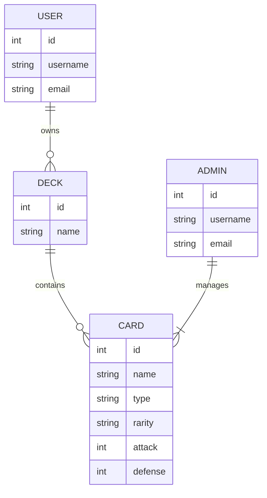
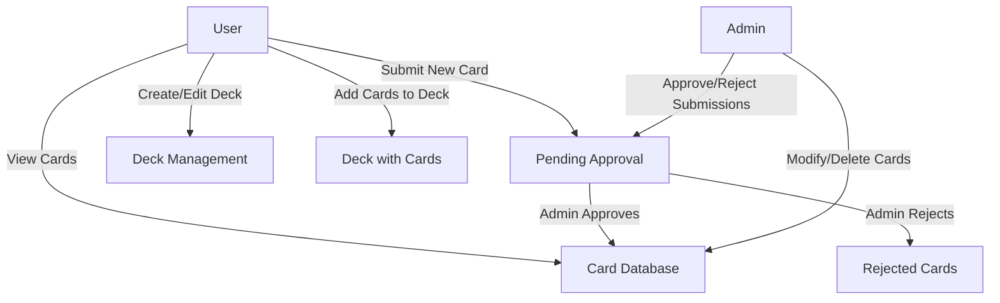
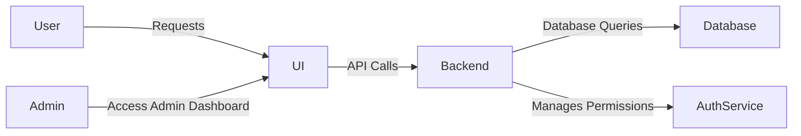
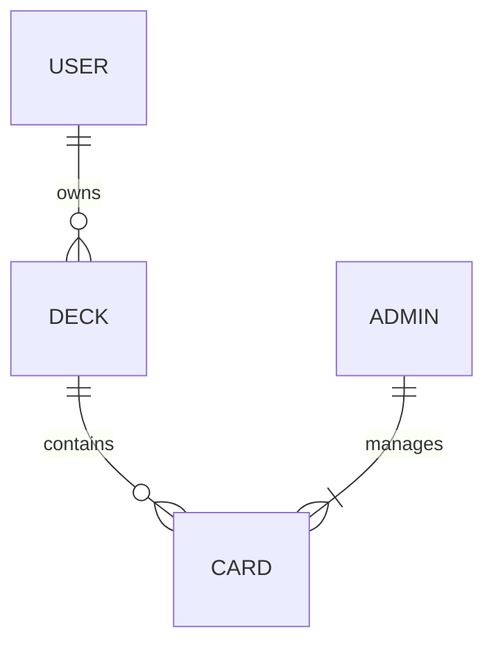

# Pokémon Card Storage Web App Documentation

## Overview
This document outlines the design of a Pokémon Card Storage Web Application. It includes diagrams and specifications for user roles, core features, and system architecture.

---

## User Roles

### Users:
- View all Pokémon cards
- Submit new cards (pending admin approval)
- Assemble and manage a deck (add/remove cards)

### Admins:
- Approve user-submitted cards
- Add new cards
- Modify and delete existing cards

---

## Core Features
- **Card Database**: Store Pokémon cards with relevant stats
- **Deck Management**: Users can create, edit, and remove decks
- **Role-Based Permissions**: Admins can manage cards, users can only submit or assemble decks
- **Approval System**: New cards require admin approval before being visible

---

## Entity-Relationship Diagram (ERD)

---

## User Flow Diagram

---

## System Architecture Diagram

---

## API Endpoints Table
| Endpoint | Method | Description | Access |
|----------|--------|-------------|---------|
| `/cards` | GET | Fetch all cards | All Users |
| `/cards` | POST | Submit a new card | Users (Approval Required) |
| `/cards/{id}` | PUT | Modify an existing card | Admins |
| `/cards/{id}` | DELETE | Remove a card | Admins |
| `/decks` | GET | Fetch all decks | Users |
| `/decks` | POST | Create a new deck | Users |
| `/decks/{id}` | PUT | Edit a deck | Users |
| `/decks/{id}` | DELETE | Delete a deck | Users |

---

## Optional Artifacts

### Database Schema

### User Stories
- **As a user**, I want to browse Pokémon cards so I can find the best ones for my deck.
- **As a user**, I want to create and manage decks so I can prepare for matches.
- **As an admin**, I want to approve submitted cards to maintain the quality of the database.

### Requirements List
#### Need to Have
- Pokémon card database with relevant stats
- User-submitted card approval system
- Deck management feature

#### Nice to Have
- Card search and filtering by type
- User profile customization
- Deck-sharing feature

---

This document serves as a foundational design plan for a Pokémon Card Storage Web App.
